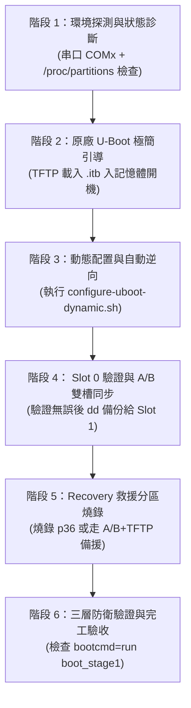

# 🚀 Spectrum SAX1V1K / ASKEY RT5010W 原廠設備改造至自訂 FW 標準工作流程規範 (WORKFLOW.md)

本文件規範本專案從「一台完全原廠狀態 (Stock Firmware) 的設備」一步一步安全改造、逆向適應並替換成「高可用自訂 OpenWrt 韌體 (Custom FW)」的標準 6 階段工作流。

任何接手的 AI Agent 或工程師在協助使用者時，**必須嚴格遵循本規範之階段順序、安全檢查項與給使用者的正確建議**。

---

## 📋 標準改造 6 階段流程圖



---

## 🔍 各階段詳細規範、檢查項與 Agent 建議 Protocol

### 階段 1：環境準備與狀態探測 (Diagnostics & Inspection)
* **Agent 行為**：
  * 檢查 Serial 串口連線（預設 `115200` 波特率）。
  * 登入 SSH 後檢視 `/proc/partitions` 實體磁碟佈局。
* **關鍵檢查項**：
  * 確認設備是 **38 分割區預留版**（含 `mmcblk0p36` `rsvd_5` 32MB），還是 **32 分割區標準版**（至 `mmcblk0p32` 結束）。
* **Agent 給使用者的建議**：
  * 「請先確認串口輸出正常。我們將先讀取分區佈局，決定後續 Recovery 的燒錄策略。」

---

### 階段 2：原廠 U-Boot 極簡引導 (Initial Bootstrapping)
* **Agent 行為**：
  * 引導使用者在原廠 U-Boot Shell (`IPQ807x#`) 將官方/自訂 `.itb` 載入記憶體開機。
* **嚴禁行為 (Anti-Pattern)**：
  * ❌ **嚴禁在原廠 U-Boot 控制台盲寫未知的 `mw` 記憶體修補位址**，否則若版本不符會導致 U-Boot 當機死鎖。
* **Agent 給使用者的建議與指令**：
  1. PC (IP `1.2.3.4`) 開啟 TFTP Server，放置 `.itb` 映像檔（**完全無須改名**）。
  2. 在 `IPQ807x#` 貼上極簡引導指令：
     ```bash
     setenv ipaddr 1.2.3.1; setenv serverip 1.2.3.4; tftpboot 44000000 <檔案名稱.itb> && bootm 44000000
     ```

---

### 階段 3：動態 U-Boot 配置與自動逆向 (Dynamic Configuration)
* **Agent 行為**：
  * 將 [`configure-uboot-dynamic.sh`](configure-uboot-dynamic.sh) 傳送至路由器的 `/tmp/` 目錄並執行。
  * **傳輸注意事項**：OpenWrt 若跳出 `sftp-server not found`，必須使用 `scp -O` 傳統協定傳輸。
* **異常狀況處理 Protocol**：
  * 若腳本提示 `ERROR: unknown U-Boot hash`（遇到全全新原廠 U-Boot 版本）：
    1. 透過 SSH dump 出 `/tmp/uboot_slot0.bin`。
    2. 在電腦執行 `python scan-uboot-hack.py uboot_slot0.bin`。
    3. 在 **0.01 秒** 取得自動計算出的 `uboot_hack` 位址，並填入 [`configure-uboot-dynamic.sh`](configure-uboot-dynamic.sh) 登錄新 Hash。

---

### 階段 4：Slot 0 驗證與 A/B 雙槽同步 (Dual-Slot Synchronization)
* **Agent 行為**：
  * 引導使用者在 Slot 0 驗證新系統的穩定性。
  * 驗證無誤後，執行雙槽 A/B 安全同步。
* **核心安全哲學**：
  * **先驗證，後複製**！Web Upgrade 預設僅刷寫 Slot 0，絕不自動雙槽同時刷寫（防止新韌體 Bug 造成連鎖死磚）。
* **Agent 給使用者的建議與指令**：
  * 「請先測試 Slot 0 的 WiFi 與網路功能。確認 100% 正常後，我們在 SSH 執行一鍵雙槽備份：
    ```bash
    dd if=/dev/mmcblk0p18 of=/dev/mmcblk0p19 && dd if=/dev/mmcblk0p20 of=/dev/mmcblk0p22 && sync
    ```

---

### 階段 5：Recovery 復原分區燒錄 (Recovery OS Provisioning)
* **Agent 行為**：
  * 根據階段 1 的探測結果，採取對應的救援處置。
* **處置 Protocol**：
  * **若為 38 分割區設備 (含 `p36`)**：
    將 `initramfs-uImage.itb` 燒錄至 Recovery 分區：
    ```bash
    dd if=/tmp/recovery.img of=/dev/mmcblk0p36 && sync
    ```
  * **若為 32 分割區設備 (無 `p36`)**：
    腳本會自動將 `boot_recovery` 降級設為 `#nop`。告訴使用者：這台設備將依靠 **「A/B 雙槽互備 + TFTP 網路載入」** 作為雙重救援防線。

---

### 階段 6：三層防線驗證與完工驗收 (Validation & Final Verification)
* **Agent 行為**：
  * 執行環境變數總檢查與按鈕實測。
* **驗收合格標準**：
  1. `fw_printenv bootcmd` 顯示 `bootcmd=run boot_stage1`。
  2. `md5sum /dev/mmcblk0p15 /dev/mmcblk0p16` 雙 Bootloader 雜湊一致。
  3. 實測斷電按住 Reset 插電 2~3 秒至藍燈恆亮放開後，短按進 Recovery 或長按 3 秒完成切槽。

---

## 📄 關聯文件索引
* [`configure-uboot-dynamic.sh`](configure-uboot-dynamic.sh) - 動態 GPT 解析與配置腳本
* [`scan-uboot-hack.py`](scan-uboot-hack.py) - 0.01 秒自動特徵碼掃描工具
* [`DYNAMIC_UBOOT_GUIDE.md`](DYNAMIC_UBOOT_GUIDE.md) - 按鈕選單與防磚機制指南
* [`UBOOT_REVERSE_ENGINEERING_GUIDE.md`](UBOOT_REVERSE_ENGINEERING_GUIDE.md) - 逆向工程指南
* [`SKILL.md`](SKILL.md) - 21 大實戰經驗維護手冊
